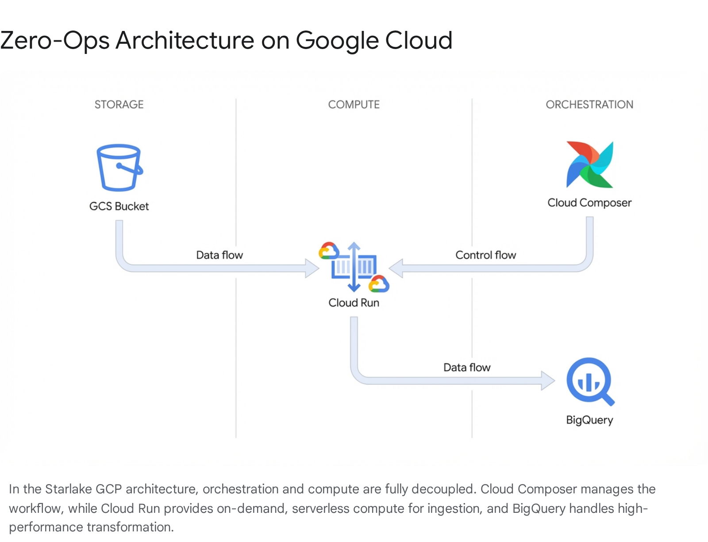
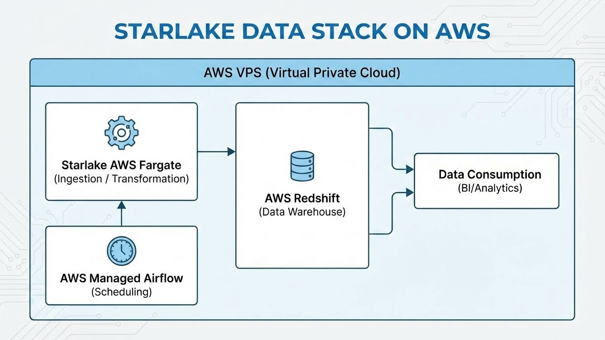

This guide provides instructions on how to run the Starlake Data Stack using Docker Compose. The configuration supports multiple orchestrators and services through Docker Compose profiles.

## Prerequisites

- **Docker**: Ensure Docker is installed and running on your machine.
- **Docker Compose**: Ensure Docker Compose is installed (usually included with Docker Desktop).

## Starlake Prebuilt Data Stacks

Starlake provides prebuilt data stacks that can be run with a single command. These data stacks are designed to provide a ready-to-use data management solution out of the box.

### Pragmatic Open Data Stack


The Pragmatic Open Data Stack is a ready-to-use data stack that includes Starlake with Airflow 3, DuckLake, Minio (optional)and Gizmo.

### Pragmatic BigQuery Data Stack



The Pragmatic BigQuery Data Stack is a ready-to-use data stack that includes Starlake with Airflow 3.

### Pragmatic Snowflake Data Stack


The Pragmatic Snowflake Data Stack is a ready-to-use data stack that includes Starlake with Snoflake Tasks.

### Pragmatic AWS Redshift Data Stack



The Pragmatic W Redshift Data Stack is a ready-to-use data stack that includes Starlake with Airflow 3.

## Quick Start

Running Starlake on Docker is as easy as running a single command.
This guide will walk you through the steps to run Starlake on Docker.

1. Clone this repository

```bash
git clone https://github.com/starlake-ai/starlake-data-stack.git
```

2. Change directory to the cloned repository

```bash
cd starlake-data-stack
```

3. Run the following command to start Starlake UI with Airflow 3 and Gizmo on Docker

```bash
COMPOSE_PROFILES=airflow3,gizmo SL_API_APP_TYPE=ducklake docker compose up  --build
```

4. Open your browser and navigate to `http://localhost` to access Starlake UI

## Configuration Variables

The Docker Compose configuration uses environment variables which can be set in a `.env` file in this directory or exported in your shell.

Common variables include:

- `SL_API_HTTP_FRONT_URL`: URL for the Starlake UI (default: `http://localhost:${SL_PORT:-80}`)
- `SL_API_DOMAIN`: Domain for the Starlake UI (default: `localhost`). This must be set if you are settings the `SL_API_HTTP_FRONT_URL` to a different host. Usually it is the same as the host of the `SL_API_HTTP_FRONT_URL` domain name.
- `SL_PORT`: Port for the Starlake UI (default: `80`)
- `SL_DB_PORT`: Port for the Postgres Database (default: `5432`)
- `SL_AI_PORT`: Port for the Starlake Agent (default: `8000`)
- `PROJECTS_DATA_PATH`: Path to your projects directory (default: `./projects`)

See the `docker-compose.yml` file for a full list of variables and their default values.

## Running Starlake

Starlake uses Docker Compose **profiles** to manage different configurations (e.g., Airflow 3, Dagster). You must specify a profile when running commands.

### Available Profiles

- **`airflow3`**: Runs Starlake with Airflow 3.
- **`dagster`**: Runs Starlake with Dagster (requires `docker-compose-dagster.yml` if running separately, but defined in main compose for some services).
- **`gizmo`**: Runs the Starlake Gizmo service.
- **`minio`**: Runs MinIO Object Storage.
- **`snowflake`**: Profile for Snowflake integration.
- **`ai`**: Runs the Starlake AI Agent service and enables the AI features in Starlake UI.

### Start Services

To start the Pragmatic Duck Data Stack with Airflow 3 and Gizmo on local file system, use the following command:

```bash
COMPOSE_PROFILES=airflow3,gizmo SL_API_APP_TYPE=ducklake docker compose up  --build
```

or simply

```
$ ./dags-stack.sh
```

To start the Pragmatic Duck Data Stack with Airflow 3 & Minio and Gizmo, use the following command:

```bash
COMPOSE_PROFILES=airflow3,minio,gizmo SL_API_APP_TYPE=ducklake docker compose up  --build
```

To start the stack with a specific profile (e.g., `airflow3`) and address any Cloud Datawarehouses, use the following commands:

```bash
COMPOSE_PROFILES=airflow3 docker compose up  --build
```

Tio run with Dagster, use the following command:

```bash
COMPOSE_PROFILES=dagster docker compose up  --build
```

### Stop Services

To stop the services:

```bash
COMPOSE_PROFILES=airflow3,gizmo,minio SL_API_APP_TYPE=ducklake docker compose down
```

_Note: You must specify the same profiles used to start the services to ensure they are all stopped correctly._

## Accessing Services

Once up, the services are accessible at the following default URLs:

- **Starlake UI**: `http://localhost` (or local port defined by `SL_PORT`)

## Troubleshooting

- **Check Logs**:
  ```bash
  docker compose --profile airflow3 logs -f
  ```
- **Rebuild Images**:
  If you need to update the images or changes in Dockerfiles:
  ```bash
  docker compose --profile airflow3 build
  ```
- **Database Persistence**:
  Postgres data is persisted in the `pgdata` volume. To reset the database, you may need to remove this volume:
  ```bash
  docker compose down -v
  ```
  > **Note**
  >
  > Whenever you update using git pull, run docker-compose with the **--build** flag:
  > `docker compose up --build`

> If you are affected by this [Docker issue](https://github.com/docker/for-mac/issues/7583), please upgrade your Docker install.

## Mounting external projects

If you have any starlake container projects and want to mount it:

- run `setup_mac_nfs.sh` if you are on mac in order to expose your folder via NFS.
  Modify the root folder to share if necessary. By default it is set to /user.
  This change is not specific to starlake and may be used in other container.
- comment `- external_projects_data:/external_projects` in the `volumes` section of the starlake-nas container
- uncomment `- starlake-prj-nfs-mount:/external_projects` right below the line above in the docker compose file
- go to the end of the file and comment uncomment the `starlake-prj-nfs-mount:` section as follows:

```
  starlake-prj-nfs-mount:
    driver: local
    driver_opts:
      type: nfs
      o: addr=host.docker.internal,rw,nolock,hard,nointr,nfsvers=3
      device: ":/path_to_starlake_project_container" # absolute path to folder on your host where projects are located.
```

Starlake container folder should contain the starlake project folder:

```
 /path_to_starlake_project_container
   |
    - my_first_starlake_project
        |
         - metadata
         - ...
   |
    - my_second_starlake_project
        |
         - metadata
         - ...
```

If you have many container projects, create as many volume as needed.

## Stopping Starlake UI

To stop Starlake UI, run the following command in the same directory

```bash
docker compose down
```
